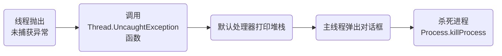

# UncaughtException为什么会导致Android应用直接退出，如何使用UncaughtExceptionHandler机制拦截“未捕获异常”并显示友好页面


## 1.UncaughtException “未捕获异常”为什么会导致应用退出

由默认的异常处理流程：



## 2.主线程与子线程的差异

* **主线程异常**：必然导致应用崩溃推出
* **子线程异常**：仅中止当前线程，不影响主线程

## 3.拦截异常并阻止退出的实现方案

* **基础拦截实现**：

```kotlin
class CustomExceptionHandler(
    private val defaultHandler: Thread.UncaughtExceptionHandler,
    private val context: Context
) : Thread.UncaughtExceptionHandler {
    override fun uncaughtException(thread: Thread, ex: Throwable) {
        //收集崩溃信息
        val crashInfo = collectCrashData(thread, ex)

        //保存崩溃日志
        saveCrashReport(crashInfo)

        //显示友好页面
        showRecoveryActivity()

        //不调用默认处理器（阻止退出）
        //defaultHandler.uncaughtException(thread, ex)
    }

    private fun showRecoveryActivity() {
        val intent = Intent(context, RecoveryActivity::class.java).apply {
            flags = Intent.FLAG_ACTIVITY_NEW_TASK
        }
        context.startActivity(intent)
    }
}
```
* **初始化**：

```kotlin
class MyApp : Application() {
    override fun onCreate() {
        super.onCreate()
        
        // 获取默认处理器
        val defaultHandler = Thread.getDefaultUncaughtExceptionHandler()
        
        // 设置自定义处理器
        Thread.setDefaultUncaughtExceptionHandler(
            CustomExceptionHandler(defaultHandler, this)
        )
    }
}
```
## 4.关键技术与注意事项

* **恢复Activity栈的技巧**：

```kotlin
fun restartApp(context: Context) {
    //获取启动Intent
    val launchIntent = context.packageManager
        .getLaunchIntentForPackage(context.packageName)
        ?.apply {
            addFlags(Intent.FLAG_ACTIVITY_CLEAR_TOP)
            putExtra("CRASH_RECOVERY", true)
        }
    //创建临时任务栈
    val stackBuilder = TaskStackBuilder.create(context).apply {
        addNextIntent(launchIntent)
    }

    //启动新任务栈
    stackBuilder.startActivities()

    //延迟杀死进程
    Handler(Looper.getMainLooper()).postDelayed({
        Process.killProcess(Process.myPid())
    }, 300)
}
```
* **异常类型过滤**：

```kotlin
override fun uncaughtException(thread: Thread, ex: Throwable) {
    when {
        isCriticalCrash(ex) -> {
            // 严重崩溃仍退出
            defaultHandler.uncaughtException(thread, ex)
        }
        isRecoverable(ex) -> {
            // 可恢复异常显示友好页面
            showRecoveryActivity()
        }
        else -> {
            // 默认处理
            defaultHandler.uncaughtException(thread, ex)
        }
    }
}

private fun isCriticalCrash(ex: Throwable): Boolean {
    return ex is OutOfMemoryError || 
           ex is StackOverflowError ||
           ex is UnsatisfiedLinkError
}
```

* **状态保存与恢复**：

```kotlin
// 在Application中保存关键状态
var lastCrashTime = 0L

override fun uncaughtException(thread: Thread, ex: Throwable) {
    lastCrashTime = System.currentTimeMillis()
    // ...其他处理
}

// 在RecoveryActivity中检查
if (System.currentTimeMillis() - (application as MyApp).lastCrashTime < 1000) {
    // 刚刚发生过崩溃
}
```


